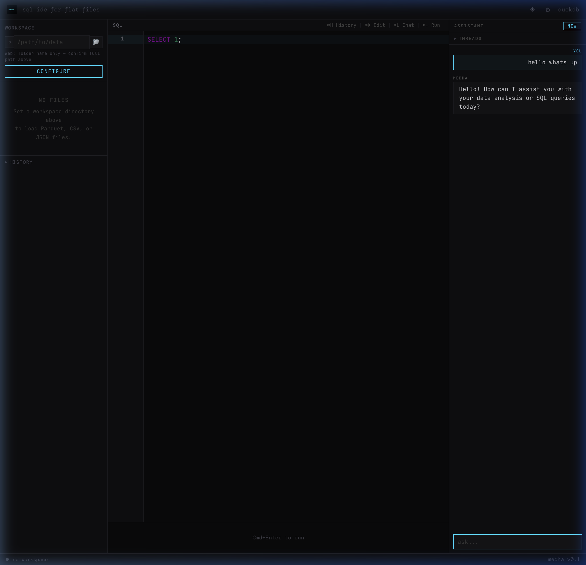
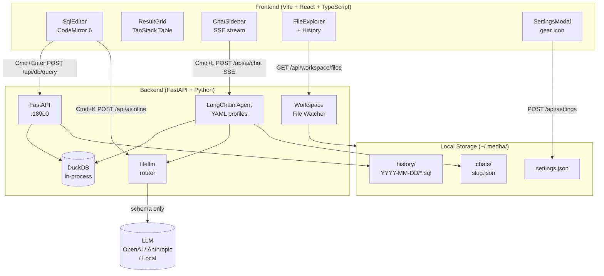

<div align="center">


# मेधा · medha

**Local-first SQL IDE for flat files. Zero setup. AI-native.**
*Local web app with theming support (Electron desktop packaging coming soon)*

[](https://opensource.org/licenses/MIT)
[](https://python.org)
[](https://astral.sh/uv)
[]()

Query Parquet, CSV, and JSON with native DuckDB speed.
`Cmd+K` to rewrite SQL inline. `Cmd+L` to explore conversationally.
Your data never leaves your machine.

[**Quickstart**](#quickstart) · [**Key bindings**](#key-bindings) · [**Architecture**](#architecture) · [**Contributing**](#contributing)

---



</div>

---

## Why Medha

Most data tools require a database server, a cloud account, or a browser extension that phones home. Medha is different:

- **No server.** DuckDB runs in-process. Open a folder, start querying.
- **No egress.** The LLM sees your column names and types. Never your rows.
- **No lock-in.** Switch between OpenAI, Anthropic, OpenRouter, or a local model in settings.
- **No ceremony.** `just dev`, pick a folder, write SQL.

मेधा (medhā) is Sanskrit for intelligence or mental power, the kind that comes from seeing patterns clearly.

---

## Features

| Feature | Description |
|---------|-------------|
| **Native DuckDB** | Reads Parquet, CSV, JSON, JSONL directly. No import step. Up to 500MB+ files. |
| **Cmd+K inline edit** | Select any SQL, describe a change, see a red/green diff, accept or reject. |
| **Cmd+L chat agent** | Conversational data exploration. Agent checks schema, samples data, validates SQL. |
| **YAML agent profiles** | Swap model, temperature, prompt, and iteration limit without touching code. |
| **SQL history** | Every query auto-saved to `~/.medha/history/` as a `.sql` file with metadata header. |
| **Chat threads** | Conversations persist to `~/.medha/chats/`. LLM-generated slug names. |
| **Themes & UI Polish** | Native Light and Dark mode toggle with a seamless CodeMirror integration. |
| **Zero egress** | Schema only. No row data ever leaves unless you explicitly approve a sample. |
| **LLM agnostic** | litellm routing. Plug in any OpenAI-compatible endpoint including LM Studio. |

---

## Quickstart

### Prerequisites

| Tool | Version | Install |
|------|---------|---------|
| Python | 3.11+ | [python.org](https://python.org) |
| uv | latest | `curl -LsSf https://astral.sh/uv/install.sh \| sh` |
| Node.js | 20+ | [nodejs.org](https://nodejs.org) |
| just | latest | `curl --proto '=https' --tlsv1.2 -sSf https://just.systems/install.sh \| bash -s -- --to ~/.local/bin` |

### Install and run

```bash
git clone https://github.com/jayshah5696/medha
cd medha

just install   # installs backend (uv sync) + frontend (npm install)
just dev       # starts backend :18900 + frontend :5173
```

Open [http://localhost:5173](http://localhost:5173), set your workspace directory, and start querying.

### Configure your LLM

Click the gear icon (top-right) and enter your API key. Supported providers:

```
OpenAI:      sk-...
OpenRouter:  sk-or-...
LM Studio:   http://localhost:1234/v1  (no key needed)
```

Or set environment variables before `just dev`:

```bash
export OPENAI_API_KEY=sk-...
export OPENROUTER_API_KEY=sk-or-...
```

---

## Key Bindings

| Binding | Action |
|---------|--------|
| `Cmd+Enter` | Execute SQL in editor |
| `Cmd+K` | Inline AI edit: select SQL first, or place cursor |
| `Cmd+L` | Open chat sidebar |
| `Cmd+H` | Open query history |

---

## Agent Profiles

Agent behavior is defined in `backend/agents/*.yaml`. Three profiles ship by default:

| Profile | Model | Iterations | Best for |
|---------|-------|-----------|---------|
| `default` | gpt-4o-mini | 10 | General data exploration |
| `fast` | gpt-4o-mini | 5 | Simple lookups and counts |
| `deep` | claude-sonnet-4.6 | 15 | Complex multi-step analysis |

To add a profile, create a YAML file in `backend/agents/`:

```yaml
name: my-profile
model: openrouter/meta-llama/llama-3.1-70b-instruct
temperature: 0
max_iterations: 8
system_prompt: |
  You are a DuckDB SQL expert. Write precise, efficient SQL.
  Always validate before returning.
```

---

## Architecture



**Data flow for Cmd+K (inline edit):**
```
user selects SQL + types instruction
  POST /api/ai/inline  {instruction, selected_sql, active_files}
    schema fetched from DuckDB (no rows)
    litellm -> LLM -> SQL string
  diff rendered in editor (accept / reject)
```

**Data flow for Cmd+L (chat agent):**
```
user asks question
  POST /api/ai/chat  {message, active_files, thread_id}
    SSE stream opens
    LangChain ReAct agent runs:
      get_schema()     -> DuckDB local call
      sample_data()    -> DuckDB local call (5 rows max)
      execute_query()  -> DuckDB local call (20 rows max)
    tokens stream to UI
    thread saved to ~/.medha/chats/{slug}.json
```

---

## Development

```bash
just --list        # show all recipes
just dev           # start backend + frontend
just backend       # backend only (port 18900)
just frontend      # frontend only (port 5173)
just test          # backend pytest (41 tests)
just test-frontend # frontend vitest (18 tests)
just test-all      # both
just test-cov      # backend with coverage
just typecheck     # TypeScript tsc --noEmit
just lint          # ruff lint
just fmt           # ruff format
just ci            # full: install + test-all + build-frontend + typecheck
just clean         # remove build artifacts
```

---

## Project Structure

```
medha/
  backend/
    app/
      main.py          FastAPI entry, lifespan, CORS
      db.py            DuckDB manager (async, path-safe, auto-LIMIT 10k)
      workspace.py     File scanner, schema cache, file watcher
      ai/
        inline.py      Cmd+K single-turn litellm call
        tools.py       LangChain tools: get_schema, sample_data, execute_query
        agent.py       ReAct agent loaded from YAML profile
      routers/
        workspace.py   /api/workspace, /api/settings
        db.py          /api/db/query, cancel
        ai.py          /api/ai/inline, /api/ai/chat (SSE)
        history.py     /api/history
        chats.py       /api/chats
    agents/
      default.yaml     General-purpose profile
      fast.yaml        Quick-lookup profile
      deep.yaml        Deep-analysis profile
    tests/             41 passing tests (pytest)

  frontend/
    src/
      components/
        FileExplorer.tsx   Workspace files + query history
        SqlEditor.tsx      CodeMirror 6 + Cmd+K + Cmd+H
        ResultGrid.tsx     TanStack Table + truncation badge
        ChatSidebar.tsx    SSE chat + thread history
        DiffOverlay.tsx    Cmd+K accept/reject diff UI
        SettingsModal.tsx  Gear icon settings panel
      lib/api.ts           Typed fetch wrappers
      store.ts             Zustand global state
    tests/                 18 passing tests (vitest)

  justfile               Task runner
  SPEC.md                Full architecture specification
```

---

## Constraints

- Workspace is sandboxed: queries cannot path-traverse outside it
- `../` traversal rejected at the FastAPI layer
- Result rows capped at **10,000** (configurable in `backend/app/db.py`)
- Only column names and types go to the LLM. No row data unless you approve a sample.

---

## Roadmap

- [ ] Electron desktop app (single `.app` binary)
- [ ] PyInstaller sidecar packaging
- [ ] File watcher live schema invalidation in UI
- [ ] Human-in-the-loop confirmation for large table scans
- [ ] Arrow IPC for large result sets (faster than JSON)
- [ ] Multi-file JOIN context in chat agent
- [ ] Export results to CSV/Parquet

---

## Contributing

PRs welcome. Run `just ci` before submitting: all 59 tests must pass and TypeScript must be clean.

```bash
just install
just ci
```

---

## License

MIT
